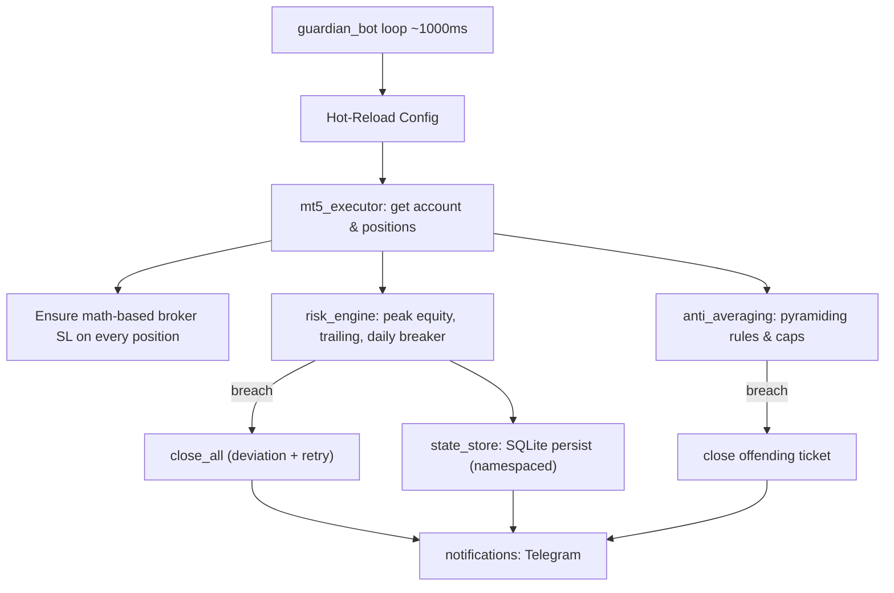

# MT5 Dynamic Equity Stoploss System (Master Plan)

This system acts as an automated "Guardian" script for MetaTrader 5 (MT5). It is designed specifically for manual scalpers with high accuracy who struggle with taking losses and revenge trading/averaging down. The script runs continuously in the background, monitors your equity, and ruthlessly cuts losses when pre-defined risk parameters are hit.

Python 3.11 + the `MetaTrader5` package, designed to run on a Windows EC2 instance.

## Core Risk Parameters

1. **Base Stoploss (1 Position):** Maximum risk of 10% from the peak equity achieved during the trade.
2. **Averaging Penalty (> 1 Position):** Maximum risk of 15% of peak equity. The larger allowance accounts for scaling in, but acts as a hard stop to prevent catastrophic "blowing up" from grid/martingale behavior.
3. **High-Water Mark Trailing:** The stoploss trails your running profits. The system tracks the "Maximum Achieved Equity" while trades are open. If equity drops by the 10%/15% threshold from that peak, everything is closed.
4. **Execution Speed:** The checks will run asynchronously every 100-1000 milliseconds to catch fast scalping movements.

## Design Decisions & Final Architecture

- **Two-Layer Protection**: A dynamically calculated broker-side hard SL is mathematically sized to be ~10% wider than the Python equity stop. It serves purely as an emergency power-outage failsafe, ensuring the Python guardian always triggers first during normal operation.
- **Dynamic Config Hot-Reloading**: Risk thresholds, pyramiding settings, and loop speeds are reloaded continuously, allowing on-the-fly tuning without restarting the bot.
- **Anti-Averaging & Pyramiding**: Caps max open positions and total volume per symbol. A toggle (`prevent_loser_add`) strictly blocks averaging down into losing trades, while allowing safe pyramiding into winning trades.
- **Isolated Multi-Account Breaker**: The daily circuit breaker safely persists across restarts in SQLite. It is heavily namespaced using `[AccountLogin]_[Date]`, preventing cross-account memory corruption when switching MT5 accounts.

## Architecture Flow

## Files Breakdown

- `requirements.txt`: `MetaTrader5`, `PyYAML`, `requests` (Telegram), `pytest` (dev).
- `config.example.yaml`: all parameters — multi-account login, thresholds, dynamic failsafe points fallback, pyramiding toggle, loop interval, server-day reset hour, Telegram settings, `mode: observe|live`.
- `src/mt5_executor.py`: connect/reconnect, `get_account()`, `get_positions()`, `ensure_stop_loss(position)` which dynamically calculates exactly how many points away the SL should be based on `tick_value` to match the equity loss %. Handles execution via `TRADE_ACTION_SLTP` and `TRADE_ACTION_DEAL`.
- `src/risk_engine.py`: pure, unit-testable functions — `update_peak_equity()`, `trailing_threshold()` (tiered tightening), `daily_drawdown_breached()`.
- `src/anti_averaging.py`: `evaluate(positions, config)` → identifies tickets to flatten when max positions/volume per symbol are exceeded, or blocks averaging down if `prevent_loser_add` is enabled.
- `src/state_store.py`: SQLite at `state/guardian.db` — persists `start_of_day_balance`, `peak_equity`, `daily_breaker_tripped`, under a strictly namespaced `Account_Date` key.
- `src/notifications.py`: Telegram push alerts.
- `src/guardian_bot.py`: Main infinite loop executing the state machine.
- `README.md` & `walkthrough.md`: Comprehensive guides on how to run, safely test via observe mode, and properly optimize an AWS EC2 instance.
